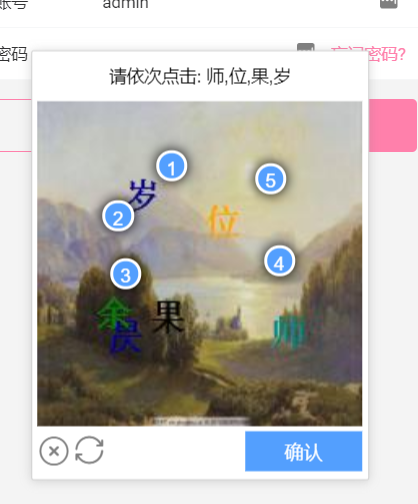

<p align="center">

</p>
<h1 align="center">vue-sim-captcha</h1>

> :cake: 一个简单易用的点触验证码, SimCaptcha 前端的 Vue.js 实现

[]()
[](https://github.com/yiyungent/vue-sim-captcha/blob/master/LICENSE)
[](https://app.fossa.com/projects/git%2Bgithub.com%2Fyiyungent%2Fvue-sim-captcha?ref=badge_shield)
[](https://www.npmjs.com/package/sim-captcha)


[English](README_en.md)

## 介绍

一个简单易用的点触验证码促进你的开发
 + **优雅** - 简单易用.
 + **免费** - MIT协议 发布

## 安装

```bash
PM> npm install vue-sim-captcha
```

## 使用

- [详细文档](https://yiyungent.github.io/SimCaptcha "在线文档") 构建中

## 相关项目

- [SimCaptcha](https://github.com/yiyungent/SimCaptcha)
- [sim-captcha-js](https://github.com/yiyungent/sim-captcha-js)
 
## 鸣谢

- 点触验证码设计参考自 <a href="https://github.com/wangchengqun/NetCoreVerificationCode" target="_blank">NetCoreVerificationCode</a>，感谢作者 wangchengqun 的贡献

## LICENSE

[](https://app.fossa.com/projects/git%2Bgithub.com%2Fyiyungent%2Fvue-sim-captcha?ref=badge_large)

## Donate

vue-sim-captcha is an MIT licensed open source project and completely free to use. However, the amount of effort needed to maintain and develop new features for the project is not sustainable without proper financial backing.

We accept donations through these channels:
- <a href="https://afdian.net/@yiyun" target="_blank">爱发电</a>

## Author

**vue-sim-captcha** © [yiyun](https://github.com/yiyungent), Released under the [MIT](./LICENSE) License.<br>
Authored and maintained by yiyun with help from contributors ([list](https://github.com/yiyungent/vue-sim-captcha/contributors)).

> GitHub [@yiyungent](https://github.com/yiyungent)

